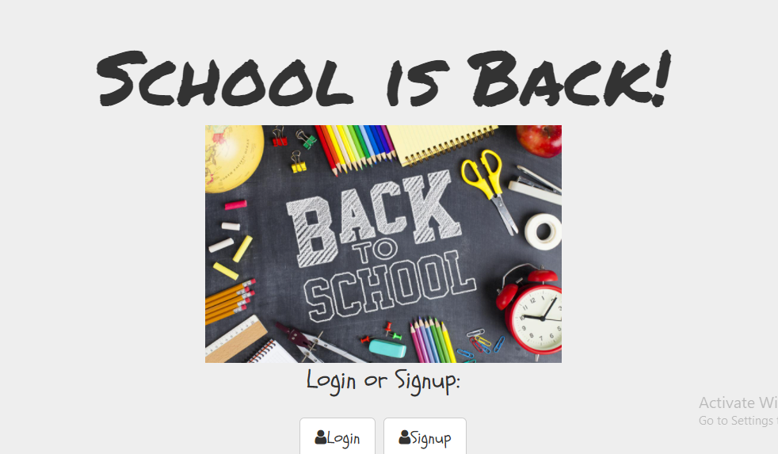

## Back to School List

I created a wesbite for parents to keep track of back to school supplies. Any items that have been added can be deleted, or "liked" if the purchase has been made.

## How It's Made

**Tech Used:** HTML, CSS, Javacrsipt, Express, Node.js, Mongo DB

This website is a page that allows the client to post a message, "like" and delete any messages that are left on the page. All results are held in a database, and requires a user log in with authentication, making it easy to keep track of all school items that still need to be purchased.

## Installation

1. Clone repo
2. run `npm install`

## Usage

1. run `node server.js`
2. Navigate to `localhost:8080`
